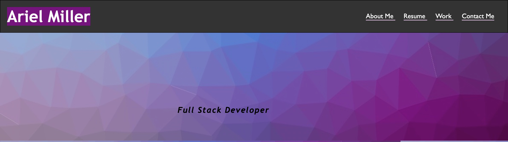
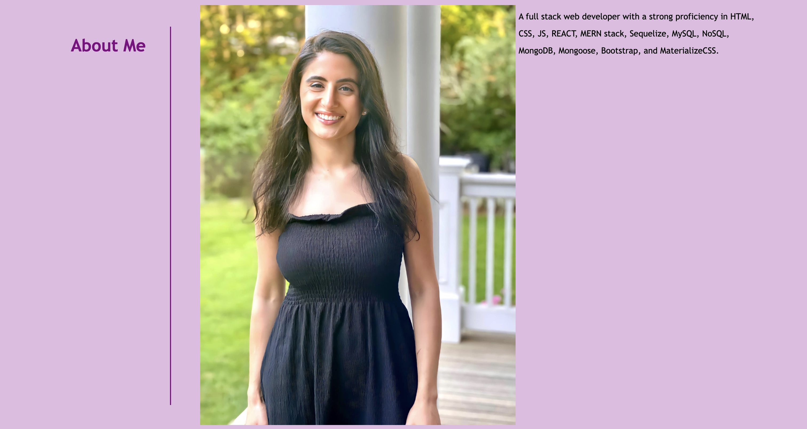
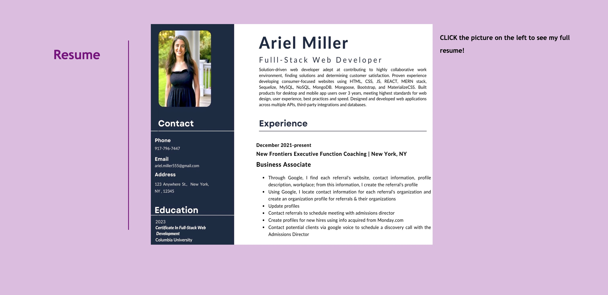
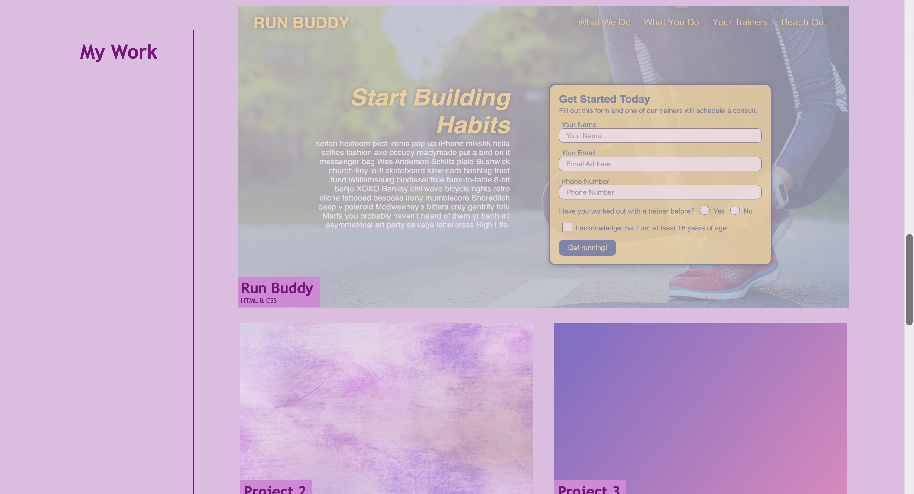
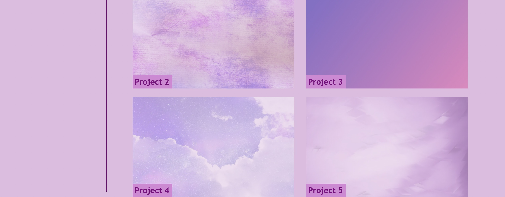
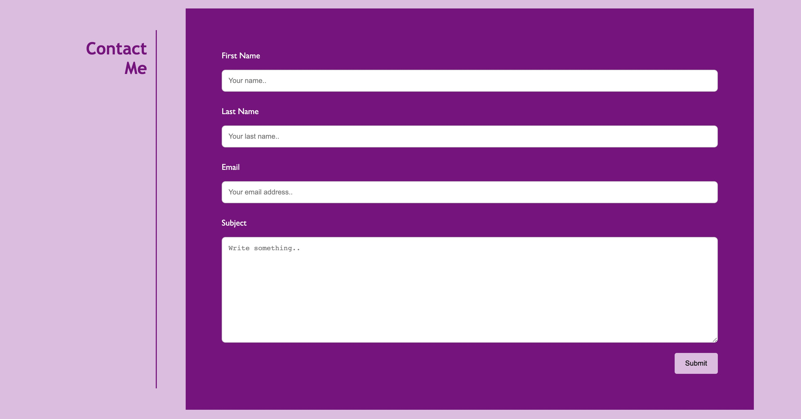
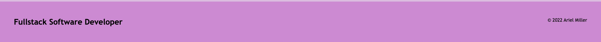
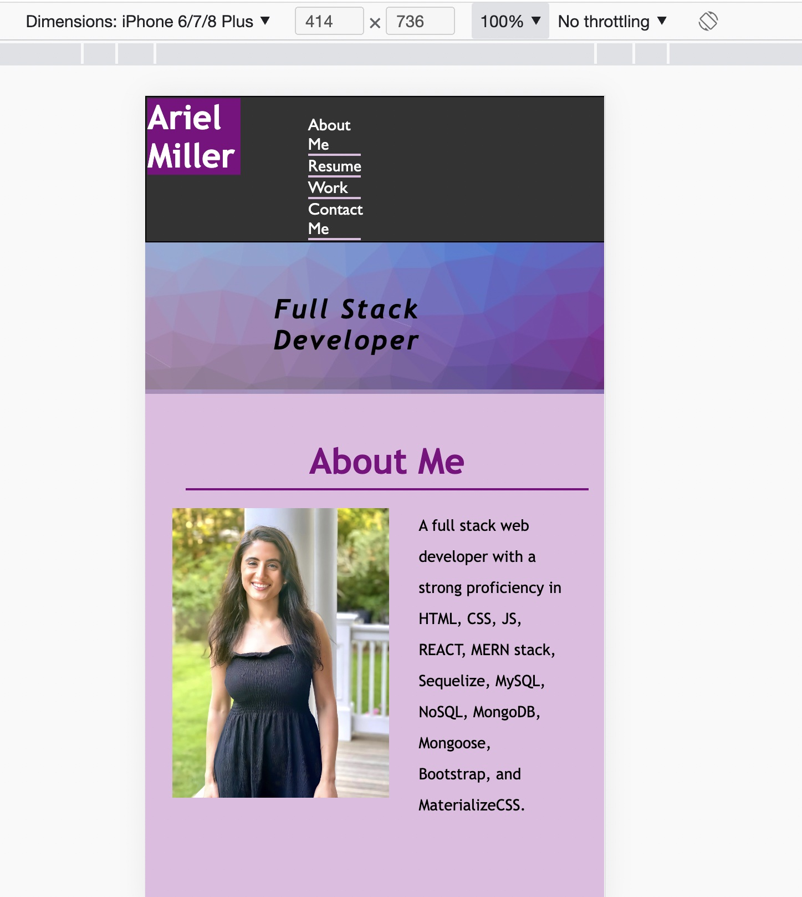

# 02 Advanced CSS: Portfolio

Welcome to this week's Challenge! This is an even-numbered week, so you won't be given any starter code. Instead, you'll create a web application from scratch! This week, you'll build a portfolio page, which you can add to as the course progresses. 

A portfolio of work can showcase your skills and talents to employers looking to fill a part-time or full-time position. An effective portfolio highlights your strongest work as well as the thought processes behind it. Students who have portfolios with deployed web applications (meaning they are live on the web) are typically very successful in their career search after the boot camp. This last point can’t be stressed enough: at many companies, having several deployed projects is a minimum requirement to receive an initial interview. 

With these points in mind, in this Challenge you’ll set yourself up for future success by applying the core skills you've recently learned: flexbox, media queries, and CSS variables. You'll get to practice your new skills while creating something that you'll use during your job search. It’s a win-win that you'll likely be grateful for in the future!

**Note**: If you don't have enough web applications to showcase at this point, use placeholder images and names. You can change them to real applications as you create them later in the course.

Let’s look at what a user story written from the perspective of a hiring manager might look like. As you might remember, we follow the AS AN / I WANT / SO THAT format.

## User Story

```
AS AN employer
I WANT to view a potential employee's deployed portfolio of work samples
SO THAT I can review samples of their work and assess whether they're a good candidate for an open position
```

## Acceptance Criteria

```
GIVEN I need to sample a potential employee's previous work
WHEN I load their portfolio
THEN I am presented with the developer's name, a recent photo or avatar, and links to sections about them, their work, and how to contact them
WHEN I click one of the links in the navigation
THEN the UI scrolls to the corresponding section
WHEN I click on the link to the section about their work
THEN the UI scrolls to a section with titled images of the developer's applications
WHEN I am presented with the developer's first application
THEN that application's image should be larger in size than the others
WHEN I click on the images of the applications
THEN I am taken to that deployed application
WHEN I resize the page or view the site on various screens and devices
THEN I am presented with a responsive layout that adapts to my viewport
```

The following animation shows the web application's appearance and functionality:


## Review
Portfolio website that is responsive with multiple platforms. When the user first uses  the link to the deployed application, they will see with a navigation bar that displays a navigation bar, with "Ariel Miller" as the h1 element in the nav bar. This bar contains four nav links, "About Me," "Resume," "Work," and "Contact Me" that connect to their specified section. Beneath the nav bar is a hero image with several shades of purple. This image contains the text "Full Stack Developer" which is the subtitle of the page. 

The About Me section contains information about my expertise as a developer. The Resume section contains a cropped image. which is a link to a PDF of the Resume. Beside the image, I instruct the user to click on this image to see my resume. The work section contains a transparent image of the website I created - Run Buddy that is clickable. The other four images are placeholders and are thus not clickable. The Contact Form provides a way for potential clients to contact me. After is the footer with the page subtitle (Fulstack Software Developer) and copyright information. 


## Screenshots of deployed application on a laptop screen 




 


## Sample view of deployed application on an iPhone 8 screen 


## URL to deployed application
https://github.com/amiller0806/HTML-Advanced-CSS-Portfolio.git

## Link to repository
https://github.com/amiller0806/HTML-Advanced-CSS-Portfolio.git 

- - -
© 2022 Trilogy Education Services, LLC, a 2U, Inc. brand. Confidential and Proprietary. All Rights Reserved.
